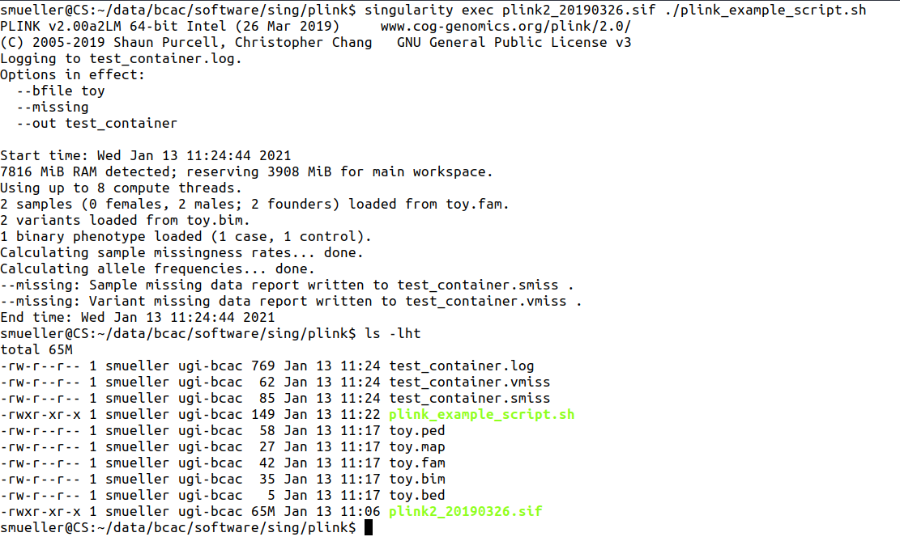
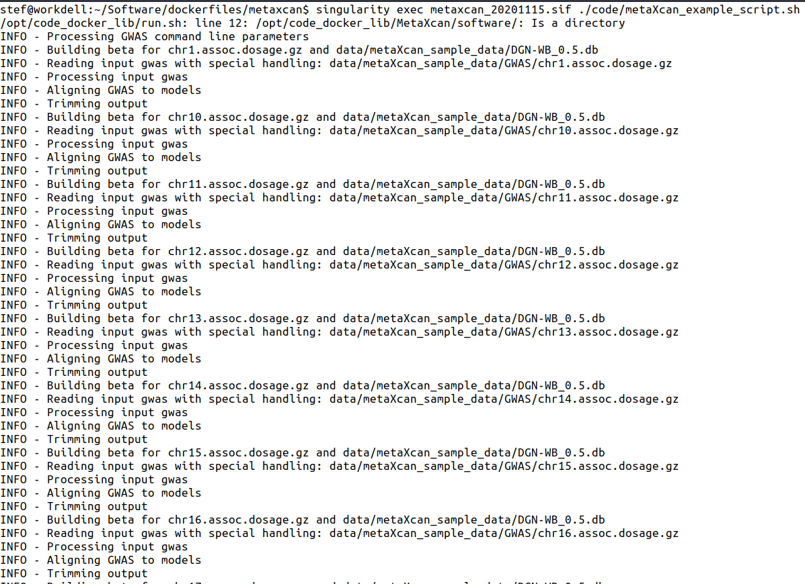
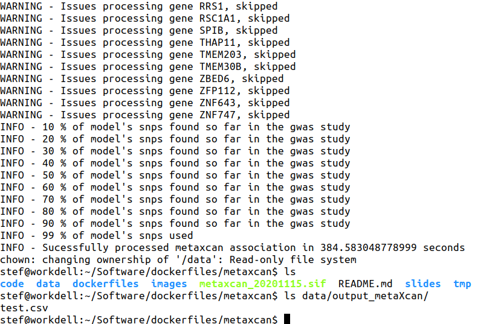

# Running Singularity Container on CS Cluster

- [Running Singularity Container on CS Cluster](#running-singularity-container-on-cs-cluster)
	- [0. Slides](#0-slides)
	- [1. Example 1: plink2](#1-example-1-plink2)
		- [1.0. Preface](#10-preface)
			- [1.0.1 Software used in Example](#101-software-used-in-example)
			- [1.0.2 docker build inspiration](#102-docker-build-inspiration)
			- [1.0.3 Container Build File](#103-container-build-file)
			- [1.0.4 Container Image on dockerhub](#104-container-image-on-dockerhub)
		- [1.1. running on cluster](#11-running-on-cluster)
			- [1.1.1 Access singularity on cluster](#111-access-singularity-on-cluster)
			- [1.1.2 Pull Image from dockerhub](#112-pull-image-from-dockerhub)
			- [1.1.3 Script to execute](#113-script-to-execute)
			- [1.1.4 run container with script](#114-run-container-with-script)
			- [1.1.5 output](#115-output)
	- [2. Example 2: MetaXcan](#2-example-2-metaxcan)
		- [2.0. Preface](#20-preface)
			- [2.0.1 Software used in Example](#201-software-used-in-example)
			- [2.0.2 docker build inspiration](#202-docker-build-inspiration)
			- [2.0.3 Container Build File](#203-container-build-file)
			- [2.0.4 Container Image on dockerhub](#204-container-image-on-dockerhub)
		- [2.1. running on cluster](#21-running-on-cluster)
			- [2.1.1 Access singularity on cluster](#211-access-singularity-on-cluster)
			- [2.1.2 Pull Image from dockerhub](#212-pull-image-from-dockerhub)
			- [1.1.3 Script to execute](#113-script-to-execute-1)
			- [1.1.4 run container with script](#114-run-container-with-script-1)
			- [1.1.5 output](#115-output-1)


## 0. Slides
Slides on [Google slides](https://docs.google.com/presentation/d/12ANoIjXoBsbaIwLdNRVM1Jh722AoTTVExYAD-3z5fTQ/edit?usp=sharing)

## 1. Example 1: plink2


### 1.0. Preface

#### 1.0.1 Software used in Example
[plink2](https://www.cog-genomics.org/plink/2.0/)

#### 1.0.2 docker build inspiration
NA

#### 1.0.3 Container Build File
Link to Dockerfile: [Dockerfile](dockerfiles/plink2/Dockerfile)

#### 1.0.4 Container Image on dockerhub
Link: [https://hub.docker.com/repository/docker/stefmueller/plink2](https://hub.docker.com/repository/docker/stefmueller/plink2)    
Name Most Recent: 'stefmueller/plink2:20190326'


### 1.1. running on cluster 

#### 1.1.1 Access singularity on cluster

On some cluster it might be necessary to load singularity client (piece of software that is managing access to and running of container).    
Not necessary on CS cluster, singularity is in PATH.

#### 1.1.2 Pull Image from dockerhub
```
singularity pull docker://stefmueller/plink2:20190326
```

Expected output:
- creation of Singularity Image File (.sif) called `plink2_20190326.sif`

#### 1.1.3 Script to execute

Script to run: [code/plink_example_script.sh](code/plink_example_script.sh)
```
#!/bin/bash

# prerequisite: copy plink toy data into current working directory

plink2 \
    --bfile toy \
    --missing \
    --out test_container
```

#### 1.1.4 run container with script
```
singularity exec plink2_20190326.sif ./plink_example_script.sh
```

#### 1.1.5 output




## 2. Example 2: MetaXcan


### 2.0. Preface
#### 2.0.1 Software used in Example
[MetaXcan](https://github.com/hakyimlab/MetaXcan)

#### 2.0.2 docker build inspiration
https://github.com/RTIInternational/code_docker_lib/tree/master/metaxcan

#### 2.0.3 Container Build File
Link to Dockerfile: [Dockerfile](dockerfiles/metaXcan/Dockerfile)

#### 2.0.4 Container Image on dockerhub
Link: [https://hub.docker.com/r/stefmueller/metaxcan/tags](https://hub.docker.com/r/stefmueller/metaxcan/tags)    
Name Most Recent: 'stefmueller/metaxcan:20201115'


### 2.1. running on cluster 

#### 2.1.1 Access singularity on cluster

On some cluster it might be necessary to load singularity client (piece of software that is managing access to and running of container).    
Not necessary on CS cluster, singularity is in PATH.

#### 2.1.2 Pull Image from dockerhub
```
singularity pull docker://stefmueller/metaxcan:20201115
```

Expected output:
- creation of Singularity Image File (.sif) called `metaxcan_20201115.sif`

#### 1.1.3 Script to execute

Script to run: [metaXcan_example_script.sh](code/metaXcan_example_script.sh)
```
#!/usr/bin/env bash

# prerequisite: copy metaXcan sample data 
#  and update INPUT and OUTPUT directory paths accordingly


source /opt/code_docker_lib/run.sh
INPUT_DIR="data/metaXcan_sample_data"
OUTPUT_DIR="data/output_metaXcan"


#./SPrediXcan.py \
/opt/code_docker_lib/MetaXcan/software/SPrediXcan.py \
--model_db_path ${INPUT_DIR}/DGN-WB_0.5.db \
--covariance ${INPUT_DIR}/covariance.DGN-WB_0.5.txt.gz \
--gwas_folder ${INPUT_DIR}/GWAS \
--gwas_file_pattern ".*gz" \
--snp_column SNP \
--effect_allele_column A1 \
--non_effect_allele_column A2 \
--beta_column BETA \
--pvalue_column P \
--output_file $OUTPUT_DIR/test.csv
```

#### 1.1.4 run container with script
```
singularity exec metaxcan_20201115.sif ./metaXcan_example_script.sh
```

#### 1.1.5 output

Start:   


And after lots of standard output finally:

